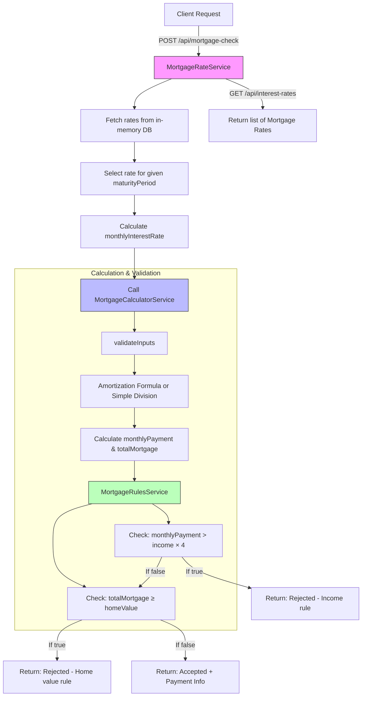

## Design Breakdown

### `MortgageCalculatorService`

- Validates input data.
- Calculates monthly mortgage using amortization logic.
- Delegates rule checks to `MortgageRulesService`.

### `MortgageRulesService`

- Contains and isolates all business rule logic.

### `MortgageRateService`

- Handles fetching and storing mortgage rate data.

### `DTOs`

- `MortgageConsultation`: Input payload for mortgage checks.
- `MortgageCalculationResult`: Result returned to client, including feasibility and financials.

---

