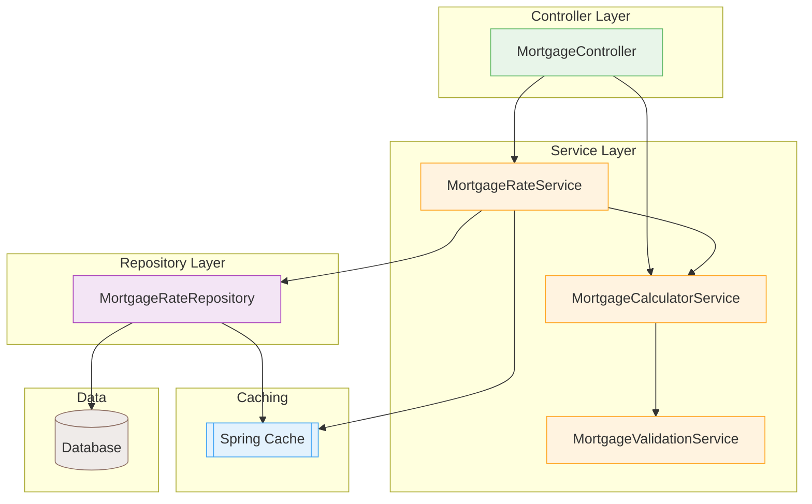

# Solution Documentation

## Overview

This solution implements a Java-based RESTful backend service for mortgage evaluation. It fulfills all the business and functional requirements outlined in the assessment.

---

## Technologies Used

- Java 17+
- Spring Boot
- Spring Data JPA (in-memory H2 database for mortgage rates)
- Spring Cache
- JUnit 5 (with parameterized tests)
- Gradle
- Docker

---

## Endpoints

### `GET /api/interest-rates`

- Returns a list of available mortgage rates.
- Data is initialized in-memory on application startup.

### `POST /api/mortgage-check`

- Accepts a JSON payload with the following fields:
    - `income`: Long
    - `homeValue`: Long
    - `loanAmount`: Long
    - `maturityPeriod`: Integer (in years)
- Returns:
    - A boolean indicating mortgage feasibility.
    - Monthly payment amount.
    - Total mortgage amount.
    - An error message if the application is rejected.

---

## Business Rules Implemented

Rules are encapsulated in `MortgageRulesService`:

1. **Monthly Mortgage Limit**: Monthly mortgage must not exceed 4× the monthly income.
2. **Home Value Limit**: Total mortgage must not exceed the value of the home.

These are evaluated after mortgage calculations and used to determine feasibility.

---

## Basic Architecture Diagram

---

## Assumptions

- Interest rates are annual and stored as percentages.
- All calculations use standard mortgage amortization formula.
- Monthly income is derived as `income / 12`.

---

## Next Steps

- Add authentication/authorization if required.
- Externalize rate data to a database or API.
- Improve error handling and localization support.

---

## How to Run

1. Clone the repository.
2. Build app jar using `./gradlew build`.
3. Build docker image using `docker build --tag 'mortgage_checker_app' .`
4. Run container using `docker run --name mortgage_checker_app -p 8080:8080 mortgage_checker_app:latest`
5. Access:
    - Swagger UI (if enabled): `http://localhost:8080/swagger-ui.html`
    - GET: `http://localhost:8080/api/interest-rates`
    - POST: `http://localhost:8080/api/mortgage-check`

---

## Author Notes

The architecture aims to be production-ready with a clean separation of concerns, testability, and adherence to SOLID principles. All logic is covered with parameterized unit tests to ensure correctness and robustness.
